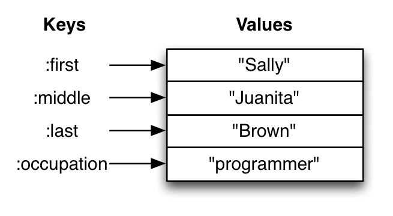

# Maps

Maps are a great way to add more meaning to the data you are working with.

## Maps hold key-value pairs

Maps hold a set of keys and the values associated with them. Values can be simple values, collections or evaluations of functions.

You can think of a map like a dictionary: you look up things using a word (a keyword) and see the definition (its value). 

> #### Hint::
> If you've programmed in another language you might have seen something like maps, maybe called dictionaries, hashes, or associative arrays.
