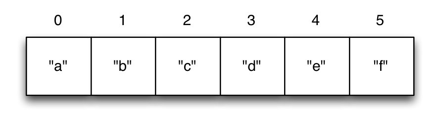

# Vectors

A vector is a sequential collection of values. A vector may be
empty. A vector may contain values of different types.

Each value in a vector is numbered starting at 0, that number is
called its index. The index is used to refer to each value when
looking them up.

## Compartment-like structure 

To imagine a vector, imagine a box split into some number of
equally-sized compartments. Each of those compartments has a number.

You can put a piece of data inside each compartment and always know
where to find it, as it has a number.

Note that the numbers start with 0. That may seem strange, but we
often count from zero when programming.

