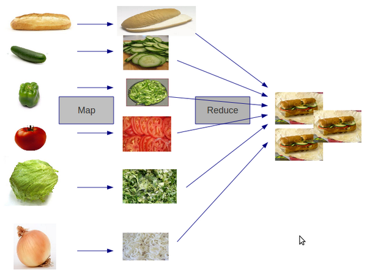

# Map Reduce Sandwich

A common pattern when manipulating lots of data can be described using the Map-Reduce Sandwich analogy.




> #### Note::Write the map reduce sandwich
> Write map and reduce functions to create the map reduce sandwich
```eval-clojure
()
```

---

> ####Hint::
> You could have a collection of strings, each string represents an ingredients.
>
> Then you could slice the ingredient by adding the string "sliced" to each ingredient.
>
> You could then reduce each "sliced ingredient" into a sandwich

<!--sec data-title="Reveal answer..." data-id="answer00" data-collapse=true ces-->


## Slice our ingredients

```clojure
(defn slice [item]
  (str "sliced " item))
```

## Map Slice over the ingredients

```clojure
(def prepared-ingredients
  (map slice ["bread" "cucumber" "pepper" "tomato" "lettuce" "onion"]))
```


## Reduce our ingredients to a sandwich

```clojure
(defn make-sandwich [ingredients]
  (reduce str (interpose ", " ingredients)))

(str "A tasty sandwich made with " (make-sandwich prepared-ingredients))
```


Here is the same map-reduce sandwich using a slightly different syntax

```clojure
(->> ["bread" "cucumber" "pepper" "tomato" "lettuce" "onion"]
     (map #(str "sliced " %) ,,,)
     (interpose ", " ,,,)
     (reduce str ,,,)
     (str "I have a tasty sandwich made with " ,,,))
```
<!--endsec-->
