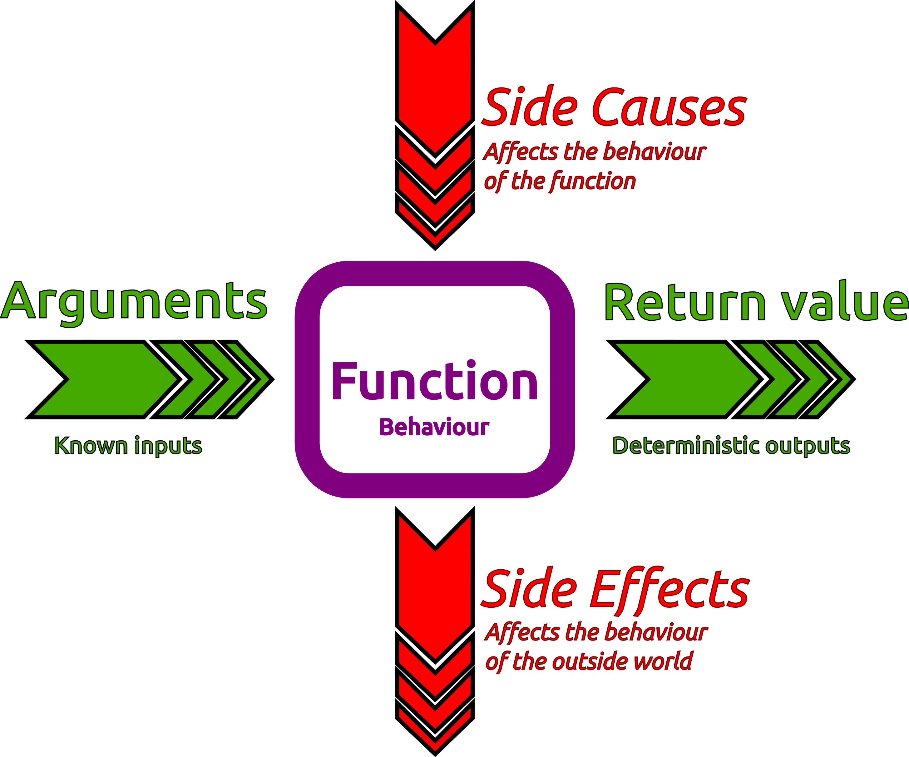

# Simplicity with Pure functions

By writing functions that are pure, you are writing simpler and more flexible code.

To be pure, a function must only depend upon it's arguments

A pure function always returns the same output for a given argument

