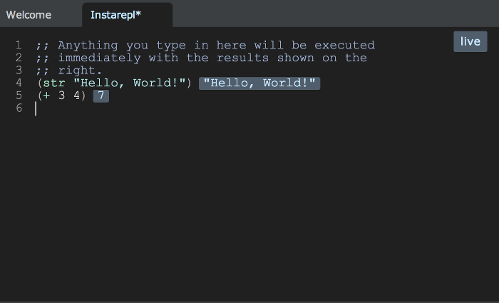

# LightTable InstaREPL

Clojure has a REPL that you can run from the terminal or you can also run a REPL from a Clojure editor like LightTable.

Using the LightTable REPL is a simple way to try writing your Clojure code.  As LightTable is also and editor, we can save our code to a file too.

> #### Note::Using the LightTable InstaREPL
> 1. Start Light Table
>
> 2. Go to the "View" menu and click "Commands."
>
>    * pressing `Ctrl-Space` is another handy way.
>
> 3. Type `insta` and press enter when you see `Instarepl: Open a Clojure instarepl` choice is highlighted.

LightTable keyboard shortcuts

| Action                                                        | PC Keypress                                           | Mac Keypress                                         |
|---------------------------------------------------------------|-------------------------------------------------------|------------------------------------------------------|
| Evaluate all the code in a file                               | <kbd>Ctrl</kbd> - <kbd>Shift</kbd> - <kbd>Enter</kbd> | <kbd>Cmd</kbd> - <kbd>Shift</kbd> - <kbd>Enter</kbd> |
| Evaluate an expression (put cursor after closing parentheses) | <kbd>Ctrl</kbd> - <kbd>Enter</kbd>                    | <kbd>Cmd</kbd> - <kbd>Enter</kbd>                    |

> #### Hint::
> When you hit enter, you should see a message about "connecting" or "retrieving deps." Wait for the instarepl to finish connecting before typing anything.

## LightTable REPL

Light Table give us a way to evaluate Clojure program file and a single line of Clojure program.
 
> #### Note::Open a REPL for the Turtle Walk project
>

* Open the file `welcometoclojurebridge/src/clojurebridge_turtle/walk.clj`.

* Press `Ctrl-Shift-Enter` or `Cmd-Shift-Enter` to evaluate the
file. 

* Press `Ctrl-Enter` or `Cmd-Enter` to evaluate each line.

<!--endsec-->

