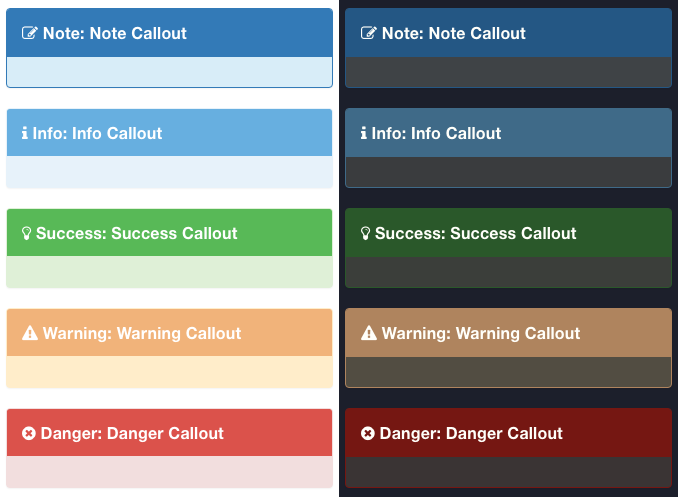

# Gitbook Plugin: Transform annotated quotes to callouts

This plugin was modified from [erixtekila/gitbook-plugin-richquotes](https://github.com/erixtekila/gitbook-plugin-richquotes) to create callouts similar to the ones provided by [Sphinx](http://www.sphinx-doc.org/).

## How to create callouts

Callouts are an extension of markdown blockquotes. All callouts must start with a h4 header, the callout type, and an optional title. The format for this is:

For Markdown:

```
> #### type::title
>
> cotent
```

For AsciiDoc:

```
> ==== type::title
> 
> content
```

Supported default callouts are:

- `> #### Info::Info`
- `> #### Note::Note`
- `> #### Tag::Tag`
- `> #### Comment::Comment`
- `> #### Hint::Hint`
- `> #### Success::Success`
- `> #### Warning::Warning`
- `> #### Caution::Caution`
- `> #### Danger::Danger`
- `> #### Quote::Quote`

Callouts are case-insensitive.

#### Installation

Add this plugin to your `book.json`:

```js
{
	"plugins": ["callouts"]
}
```

Then run `gitbook install` to download and install the plugin.

#### Override built-in callouts

You can add user defined or override built-in callouts in `book.json` file:

```js
{
	"plugins": ["callouts"],
	"pluginsConfig":
	{
		"callouts":
		{
			"star": {
				"alert": "warning",
				"picto": "fa-star"
			}
		}
	}
}
```

Alert values are:
* primary
* info
* success
* warning
* danger

Examples of each alert type (both "White" and "Night" modes supported) are:



Refer to [Font Awesome doc](http://fortawesome.github.io/Font-Awesome/icons/) for picto value.

##### Show type in header

As shown above, the callout type (`info`, `warning`, `danger`, etc.) will be shown in the callout header (`type`: `title`). If you do _not_ want to have the type displayed in the header, you can set the `showTypeInHeader` option to false.

```js
{
    "plugins": ["callouts"],
    "pluginsConfig":
    {
        "callouts":
        {
            "showTypeInHeader": false
        }
    }
}
```

As long as you have a title defined (ex. `type::title`) the type will not be displayed in the header. The type _will_ be displayed in the header if no title is defined (ex. `type::`).
